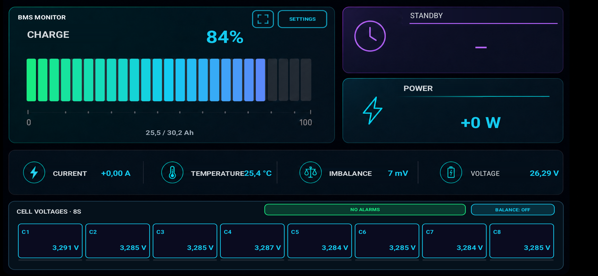

# БМС Монитор — JK/Jikong BMS

Приложение для мониторинга аккумуляторов с JK/Jikong BMS по Bluetooth LE.
Показывает состояние батареи на Android-устройстве и предоставляет локальную
веб-панель для просмотра данных с компьютера или другого телефона в той же
Wi-Fi-сети.

> © 2026 zayants. All rights reserved. Это публичный репозиторий готовых
> выпусков. Исходный код приложения не публикуется.

## Скачать

**[Скачать последнюю версию APK](https://github.com/zayants/cell-scope-jk-bms/releases/latest)**

Текущая версия: **1.0.5**. Поддерживается Android 8.0 и новее.

APK распространяется для ручной установки. Android или Google Play Protect
могут предупредить, что приложение установлено не из Google Play. Проверяйте
имя файла, страницу релиза и контрольную сумму SHA-256 перед установкой.

### Контрольная сумма версии 1.0.5

```text
6F76E2FFFCE592C717008404FFCBFB59D82948190B79289340B983F764019CFF
```

Файл: `BMS-Monitor-1.0.5.apk`

## Возможности

- SOC, напряжение, ток, мощность и оставшаяся ёмкость;
- прогноз времени до полного заряда или разряда;
- температура, разбаланс и аварийные состояния;
- напряжение каждой ячейки и активная балансировка;
- выбор конкретной BMS из найденных Bluetooth-устройств;
- автоматическое переподключение к выбранной BMS;
- русский, украинский и английский интерфейс;
- вертикальный и альбомный режимы;
- локальная веб-панель по Wi-Fi с QR-кодом и цифровым адресом;
- получение данных по запросу через Telegram-бота.

Приложение не изменяет защитные параметры BMS и состояние зарядного или
разрядного MOSFET. В текущей версии доступно локальное управление балансировкой.

## Реальные экраны приложения

### Вертикальный режим


### Альбомный режим



## Цветовые обозначения

| Цвет | Значение |
| --- | --- |
| Голубой | Нормальное значение |
| Зелёный | Соединение установлено или ячейка участвует в балансировке |
| Жёлтый | Предупреждение |
| Красный | Авария или критическое отклонение |
| Синий | Низкая температура |
| Серый или прочерк | Нет актуальных данных от BMS |

## Bluetooth и геолокация

На Android 11 и некоторых прошивках Xiaomi для полного BLE-сканирования должна
быть включена системная геолокация. Приложение не определяет, не сохраняет и не
передаёт координаты пользователя. На Android 12 и новее также необходимо
разрешение «Устройства поблизости».

Перед подключением закройте штатное приложение JK BMS: одна BMS обычно не
поддерживает два активных BLE-соединения одновременно.

## Совместимость

Проверено на Android 8, 11/12 и 15, а также на JK-B1A8S10P с протоколом JK02.
Другие модели JK/Jikong могут работать, но требуют проверки на реальном
оборудовании.

## Конфиденциальность и безопасность

- [Политика конфиденциальности](PRIVACY.md)
- [Безопасность и сообщение об уязвимостях](SECURITY.md)
- [Авторство](AUTHORS)
- [Условия использования](LICENSE)

Ошибки и результаты проверки новых моделей BMS можно отправлять через
[Issues](https://github.com/zayants/cell-scope-jk-bms/issues).
