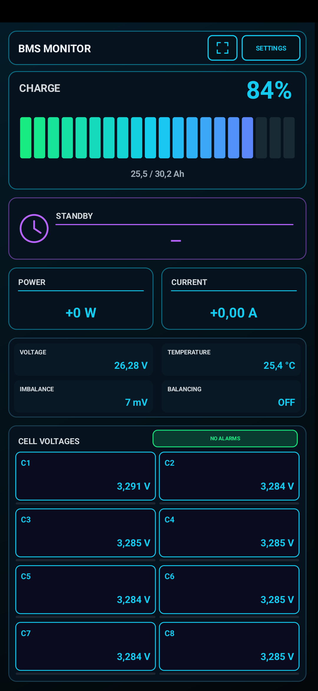

# BMS Monitor for JK/Jikong BMS

An Android battery monitor for JK/Jikong BMS devices over Bluetooth Low Energy.
It displays live battery and cell data on a phone or tablet and provides a local
web dashboard for computers and other devices on the same Wi-Fi network.

> © 2026 zayants. All rights reserved. This repository distributes official
> application releases and documentation. The application source code is not public.

## Download

**[Download the latest APK from GitHub Releases](https://github.com/zayants/cell-scope-jk-bms/releases/latest)**

Current public version: **1.0.7**. Requires **Android 8.0 or later**.

The APK is distributed for manual installation. Android or Google Play Protect
may warn that it was downloaded outside Google Play. Always verify the filename,
release page, and SHA-256 checksum before installing it.

### Version 1.0.7 checksum

```text
5BC405C8E476F673FB5C2DA0B7488B642945AA0197B4201740323475E6D1B79C
```

File: `BMS-Monitor-1.0.7.apk`

## Features

- SOC, total voltage, current, power, and remaining capacity;
- estimated time to full charge or discharge;
- battery temperature, cell imbalance, and alarm status;
- individual cell voltages and active balancing indication;
- selection of a specific BMS from discovered Bluetooth devices;
- automatic reconnection to the selected BMS;
- English, Ukrainian, and Russian interfaces;
- portrait and landscape layouts for phones and tablets;
- local Wi-Fi web dashboard with a QR code and readable network address;
- on-demand telemetry through a user-configured Telegram bot.

The application does not change BMS protection settings or charge/discharge
MOSFET states. The current version provides local balancing control.

## Real application screens

### Portrait mode



### Landscape mode


## Status colors

| Color | Meaning |
| --- | --- |
| Cyan | Normal value |
| Green | Connected, normal, or actively balancing cell |
| Yellow | Warning |
| Red | Alarm or critical deviation |
| Blue | Low temperature |
| Gray or dash | No current BMS data |

## Bluetooth and location requirements

Android 11 and some Xiaomi firmware versions require system Location to be
enabled for complete BLE scanning. BMS Monitor does not determine, store, or
transmit your location. Android 12 and later also require the Nearby devices
permission.

Close the official JK BMS application before connecting. Most BMS devices allow
only one active BLE client at a time.

## Compatibility

Tested on Android 8, Android 11/12, and Android 15 with a JK-B1A8S10P using the
JK02 protocol. Other JK/Jikong models may work but should be verified on real
hardware. Compatibility reports are welcome.

## Privacy, security, and support

- [Privacy policy](PRIVACY.md)
- [Security policy and vulnerability reporting](SECURITY.md)
- [Authorship](AUTHORS)
- [License](LICENSE)

Report bugs and tested BMS models through
[GitHub Issues](https://github.com/zayants/cell-scope-jk-bms/issues).
